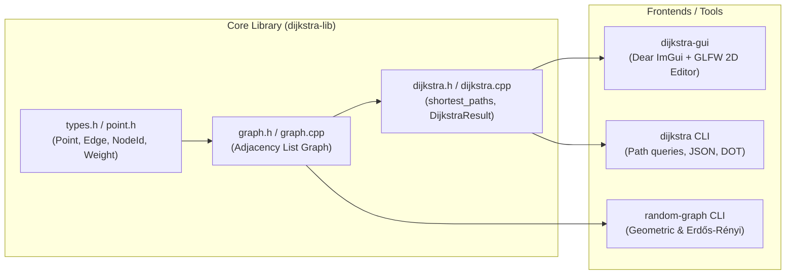

# Dijkstra

[](https://github.com/vikman90/dijkstra/actions/workflows/cmake.yml)
[](https://vikman90.github.io/dijkstra)
[](https://en.wikipedia.org/wiki/C%2B%2B20)
[](LICENSE)

An educational and high-performance **C++20 implementation of [Dijkstra's shortest path algorithm](https://en.wikipedia.org/wiki/Dijkstra%27s_algorithm)** and graph data structures.

---

## 📖 Interactive Documentation

👉 **[Explore Full Guide & Visual Walkthroughs](https://vikman90.github.io/dijkstra)**

The documentation includes:
- **[Interactive GUI](https://vikman90.github.io/dijkstra/gui/)**: Complete guide to the 2D canvas editor, step-by-step playback, and HUD metrics.
- **[Algorithm & Theory](https://vikman90.github.io/dijkstra/algorithm/)**: Step-by-step visual trace with Mermaid diagrams, relaxation mechanics, and proofs.
- **[Data Structures](https://vikman90.github.io/dijkstra/data-structures/)**: In-depth comparison of Adjacency Lists vs Matrices and priority queue caching behavior.
- **[Modern C++ Guide](https://vikman90.github.io/dijkstra/cpp-features/)**: Practical guide to `std::optional`, `<ranges>`, spaceship operator `<=>`, structured bindings, and exception design.
- **[CLI Reference](https://vikman90.github.io/dijkstra/cli/)**: Comprehensive command-line options and Graphviz visualization.
- **[Testing Strategy](https://vikman90.github.io/dijkstra/testing/)**: Testing pyramid, GoogleTest suites, integration tests, and ASan/UBSan.

---

## 🏗️ Architecture & Features



- **Interactive 2D GUI**: Built with Dear ImGui and GLFW for real-time node editing, animated playback, timeline scrubbing, and live execution statistics.
- **Clean Decoupling**: Standalone static library (`dijkstra-lib`) under `namespace dijkstra` with zero CLI or UI dependencies.
- **Memory & Time Efficiency**: Sparse adjacency list representation ($\mathcal{O}(V + E)$ space) and cache-friendly priority queue ($\mathcal{O}((V + E) \log V)$ time).
- **Target-Specific Search**: Early exit optimization when querying paths between specific source and destination nodes.
- **Rich Results**: `DijkstraResult` provides path reconstruction, distance queries, reachability checks, and multiple output formats (Text, JSON, Graphviz DOT).
- **Robust Error Handling**: Dedicated domain exception hierarchy (`GraphParseException`, `InvalidNodeException`, `NegativeWeightException`) instead of process termination.

---

## 🚀 Setup & Build

### Requirements

- Modern C++ compiler with C++20 support (`g++ >= 11` or `clang++ >= 13`).
- CMake `3.22` or above.

### Build via CMake Presets (Recommended)

```bash
# Configure, build, and run tests
cmake --preset default
cmake --build --preset default -j$(nproc)
ctest --preset default
```

### Standard CMake Build

```bash
# Debug build with tests
cmake -B build -DCMAKE_BUILD_TYPE=Debug -DBUILD_TESTING=ON
cmake --build build -j$(nproc)

# Run full test suite
ctest --test-dir build --output-on-failure
```

## 🖥️ Interactive GUI Application (`dijkstra-gui`)
Launch the interactive desktop visualizer:

```bash
./build/src/gui/dijkstra-gui
```

- **Double-Click**: Create a new vertex at mouse cursor.
- **Click & Drag**: Move vertex position on 2D canvas.
- **Shift + Click**: Create an edge between two vertices.
- **Right-Click**: Open context menu to edit weights, set Start/Target, or delete elements.
- **Playback Controls**: Step through Dijkstra's algorithm with Play/Pause, speed slider, and timeline scrubber.

---

## 💻 CLI Usage

### 1. Finding Shortest Paths (`dijkstra`)

```bash
# Calculate all shortest paths from node 0
dijkstra -s 0 graph.txt

# Query path specifically to target node 5 with early exit
dijkstra -s 0 -t 5 graph.txt

# Output formatted JSON
dijkstra -s 0 -f json graph.txt
```

### 2. Generating Synthetic Graphs (`random-graph`)

```bash
# Generate 2D geometric random graph (10 nodes, 3 connections per node)
random-graph -n 10 -k 3 -s 42

# Generate Erdős-Rényi graph with edge probability p = 0.35
random-graph -n 20 -p 0.35 -s 12345
```

### 3. Piped Pipeline Execution

```bash
random-graph -n 8 -k 3 -s 42 | dijkstra -s 0
```

Output:
```text
Running Dijkstra's algorithm... [0.005 ms.]
  → 0 [0]
0 → 1 [0.57554]
0 → 2 [0.671688]
1 → 3 [1.27469]
0 → 4 [0.574014]
```

---

## 🧪 Testing & Quality Assurance

### Run Unit and Integration Tests

```bash
ctest --test-dir build --output-on-failure --verbose
```

### Run with Sanitizers (ASan & UBSan)

```bash
cmake -B build-asan -DCMAKE_BUILD_TYPE=Debug -DENABLE_SANITIZERS=ON
cmake --build build-asan -j$(nproc)
ctest --test-dir build-asan --output-on-failure
```

---

## 🤝 Contributing

Please consult [**AGENTS.md**](AGENTS.md) for development guidelines, coding conventions, and commit standards.

---

## 📄 License

This project is licensed under the MIT License — see the [LICENSE](LICENSE) file for details.
