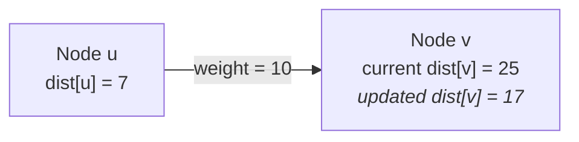
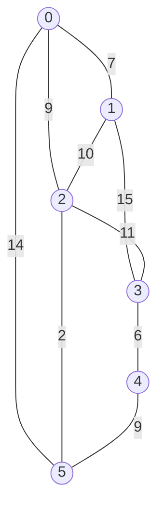
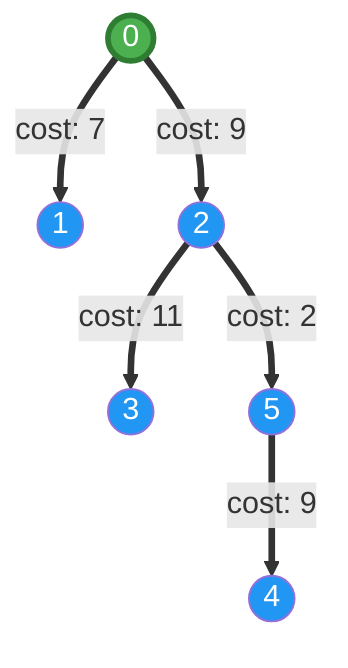

# Dijkstra's Algorithm: Theory & Visual Walkthrough

Dijkstra's algorithm, conceived by Dutch computer scientist **Edsger W. Dijkstra** in 1956 and published in 1959, is one of the most fundamental algorithms in computer science and graph theory. It solves the **Single-Source Shortest Path (SSSP)** problem for weighted graphs with non-negative edge weights.

---

## 1. Problem Formulation

Given a graph $G = (V, E)$ with non-negative edge weights $w: E \to \mathbb{R}_{\ge 0}$ and a designated source vertex $s \in V$, the objective is to find the minimum path cost $\delta(s, v)$ from $s$ to every vertex $v \in V$:

$$\delta(s, v) = \min_{p = \langle s, \dots, v \rangle} \sum_{e \in p} w(e)$$

If $v$ is unreachable from $s$, $\delta(s, v) = \infty$.

> [!IMPORTANT]
> **Non-negative weights condition**: Dijkstra's algorithm relies on the property that adding an edge to a path never decreases its total cost:
> $$\forall e \in E, \quad w(e) \ge 0$$
> If negative edge weights are present, algorithms like **Bellman-Ford** or **Floyd-Warshall** must be used instead.

---

## 2. Core Concepts: Relaxation and Greedy Choice

### 2.1 The Relaxation Step
The core building block of shortest-path discovery is **edge relaxation**. Given an edge $(u, v)$ with weight $w(u, v)$, relaxation checks whether routing through $u$ offers a strictly shorter path to $v$ than the best path found so far:

$$\text{if } \text{dist}[u] + w(u, v) < \text{dist}[v] \implies \begin{cases} \text{dist}[v] \leftarrow \text{dist}[u] + w(u, v) \\ \text{prev}[v] \leftarrow u \end{cases}$$

### 2.2 Invariant & Optimal Substructure
At every step, the algorithm maintains a set of **settled vertices** $S \subseteq V$ for which the shortest path distance has been finalized ($\text{dist}[u] = \delta(s, u)$). 

By greedily extracting the unsettled vertex $u \notin S$ with the minimum tentative distance $\text{dist}[u]$, we are guaranteed that no other path through unsettled nodes could reach $u$ with a smaller distance (since all other unsettled nodes have tentative distances $\ge \text{dist}[u]$ and edge weights are non-negative).

---

## 3. Step-by-Step Visual Walkthrough

Consider the canonical 6-node Wikipedia sample graph ($V = \{0, 1, 2, 3, 4, 5\}$) with source node $s = 0$:

### Step-by-Step Execution Trace

| Step | Extracted Node | Min Distance | Neighbors Relaxed | Priority Queue (Min-Heap) | Settled Nodes |
|:---:|:---:|:---:|:---|:---|:---|
| **0** | — | — | Initialization: $\text{dist}[0] = 0$, all others $\infty$ | `[(0, 0)]` | $\emptyset$ |
| **1** | **0** | $0$ | (0,1): $7$, (0,2): $9$, (0,5): $14$ | `[(7, 1), (9, 2), (14, 5)]` | $\{0\}$ |
| **2** | **1** | $7$ | (1,2): $7+10=17 > 9$ (no update), (1,3): $7+15=22$ | `[(9, 2), (14, 5), (22, 3)]` | $\{0, 1\}$ |
| **3** | **2** | $9$ | (2,3): $9+11=20 < 22$ (updated!), (2,5): $9+2=11 < 14$ (updated!) | `[(11, 5), (14, 5), (20, 3), (22, 3)]` | $\{0, 1, 2\}$ |
| **4** | **5** | $11$ | (5,4): $11+9=20$ | `[(14, 5), (20, 3), (20, 4), (22, 3)]` | $\{0, 1, 2, 5\}$ |
| **5** | — | (14, 5) | Skipped (5 already settled) | `[(20, 3), (20, 4), (22, 3)]` | $\{0, 1, 2, 5\}$ |
| **6** | **3** | $20$ | (3,4): $20+6=26 > 20$ (no update) | `[(20, 4), (22, 3)]` | $\{0, 1, 2, 3, 5\}$ |
| **7** | **4** | $20$ | No unvisited neighbors | `[(22, 3)]` | $\{0, 1, 2, 3, 4, 5\}$ |

### Final Shortest Paths Result

- **Path to 0**: `[0]` (Cost: 0)
- **Path to 1**: `0 → 1` (Cost: 7)
- **Path to 2**: `0 → 2` (Cost: 9)
- **Path to 3**: `0 → 2 → 3` (Cost: 20)
- **Path to 4**: `0 → 2 → 5 → 4` (Cost: 20)
- **Path to 5**: `0 → 2 → 5` (Cost: 11)

---

## 4. Complexity Analysis

| Data Structure | Graph Representation | Time Complexity | Space Complexity |
|:---|:---|:---:|:---:|
| **Binary Min-Heap (`std::priority_queue`)** | **Adjacency List (Our implementation)** | $\mathcal{O}((V + E) \log V)$ | $\mathcal{O}(V + E)$ |
| Unordered Array (Linear scan) | Adjacency Matrix | $\mathcal{O}(V^2)$ | $\mathcal{O}(V^2)$ |
| Fibonacci Heap (Theoretical) | Adjacency List | $\mathcal{O}(E + V \log V)$ | $\mathcal{O}(V + E)$ |

> [!TIP]
> **Why `std::priority_queue` outperforms Fibonacci Heaps in practice**:
> Although Fibonacci Heaps offer $O(E + V \log V)$ theoretical asymptotic bound, their node allocation overhead, pointer chasing, and large constant factors make standard array-backed binary heaps (`std::priority_queue`) significantly faster in practical C++ applications due to **CPU cache locality**.
