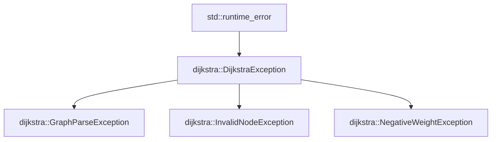

# Modern C++ (C++20) Idioms & Features

This project serves as a showcase of modern C++20 design patterns, safety principles, and idiomatic library design.

---

## 1. Key C++20 Features Used

### 1.1 Spaceship Operator (`<=>`) for Three-Way Comparison
Rather than writing boilerplate comparison operators (`==`, `!=`, `<`, `<=`, `>`, `>=`), C++20 introduces the defaulted three-way comparison operator:

```cpp
struct Point {
    double x{0.0};
    double y{0.0};

    [[nodiscard]] auto operator<=>(const Point &) const = default;
};

struct Edge {
    NodeId from{0};
    NodeId to{0};
    Weight weight{0.0};

    [[nodiscard]] auto operator<=>(const Edge &) const = default;
};
```
The compiler automatically generates consistent equality and relational operators based on member lexicographical order.

---

### 1.2 `std::optional<T>` for Explicit Value Semantics
Instead of magic sentinel values (such as `-1` or `DBL_MAX`), optionality is explicitly captured by the type system:

```cpp
// Returns std::nullopt if the target is unreachable
[[nodiscard]] std::optional<Weight> distance_to(NodeId destination) const;

// Returns std::nullopt if no path exists
[[nodiscard]] std::optional<std::vector<NodeId>> path_to(NodeId destination) const;

// Optional seed for deterministic graph generation
[[nodiscard]] static Graph random_geometric(
    std::size_t nodes,
    std::size_t connections,
    std::optional<std::uint64_t> seed = std::nullopt
);
```

---

### 1.3 `[[nodiscard]]` Attribute
To prevent subtle bugs caused by ignoring query results or computed paths, query methods and factories are annotated with `[[nodiscard]]`:

```cpp
[[nodiscard]] DijkstraResult shortest_paths(const Graph &graph, NodeId source);
[[nodiscard]] bool has_edge(NodeId u, NodeId v) const;
[[nodiscard]] std::size_t node_count() const noexcept;
```

---

### 1.4 Structured Bindings & Min-Heap Idioms
Decomposing tuple-like objects directly into named local variables simplifies code readability:

```cpp
using QueueElement = std::pair<Weight, NodeId>;
std::priority_queue<
    QueueElement,
    std::vector<QueueElement>,
    std::greater<QueueElement>>
    pq;

while (!pq.empty()) {
    auto [d, u] = pq.top(); // Structured binding (d = weight, u = node)
    pq.pop();
    // ...
}
```

---

## 2. Robust Domain Exception Hierarchy

Library code must never terminate the process (`exit()`). Instead, well-typed exceptions derived from `std::runtime_error` are thrown and can be handled upstream:



```cpp
try {
    Graph g;
    file >> g;
    auto result = shortest_paths(g, 0);
} catch (const dijkstra::InvalidNodeException &e) {
    std::cerr << "Invalid node: " << e.what() << "\n";
} catch (const dijkstra::GraphParseException &e) {
    std::cerr << "Malformed input: " << e.what() << "\n";
}
```

---

## 3. Namespace Decoupling & Header Hygiene

- All library components reside in `namespace dijkstra`.
- Header files never use `using namespace std;` to avoid namespace pollution.
- Headers are placed in `include/dijkstra/` and exported cleanly via CMake target interface properties:
```cmake
target_include_directories(dijkstra-lib
    PUBLIC
        $<BUILD_INTERFACE:${PROJECT_SOURCE_DIR}/include>
        $<INSTALL_INTERFACE:include>
)
```
