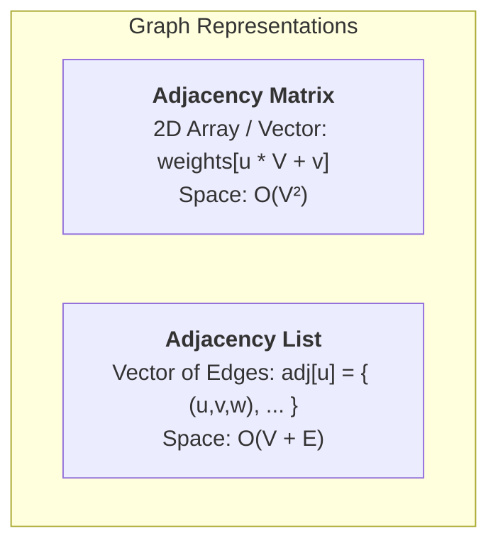
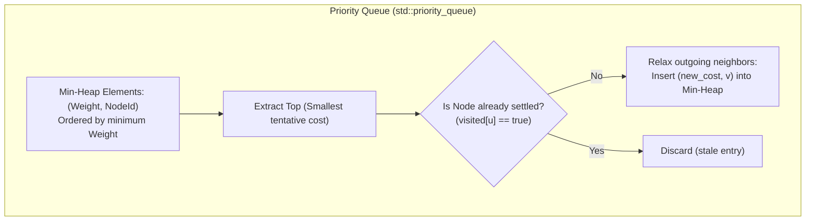
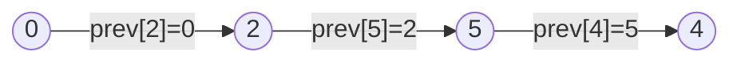

# Graph Data Structures & Priority Queues

Choosing the right data structures is essential for implementing efficient graph algorithms. This document compares different graph representations and explains the engineering decisions behind this library.

---

## 1. Graph Representations: Adjacency List vs Adjacency Matrix

Graphs can be stored in memory using two primary models:



### 1.1 Comparison Matrix

| Property | Adjacency Matrix | Adjacency List (Used in Dijkstra Lib) |
|:---|:---:|:---:|
| **Memory Consumption** | $\mathcal{O}(V^2)$ | $\mathcal{O}(V + E)$ |
| **Iterating Neighbors of $u$** | $\mathcal{O}(V)$ | $\mathcal{O}(\text{deg}(u))$ |
| **Edge Existence Query $(u, v)$** | $\mathcal{O}(1)$ | $\mathcal{O}(\text{deg}(u))$ |
| **Add / Update Edge** | $\mathcal{O}(1)$ | $\mathcal{O}(\text{deg}(u))$ |
| **Ideal For** | Dense graphs ($E \approx V^2$) | Sparse graphs ($E \ll V^2$), Road networks, Trees |

### 1.2 Memory Impact in Practice

Consider a graph of $V = 100{,}000$ vertices and average degree $k = 4$ ($E = 400{,}000$ edges):

- **Adjacency Matrix**:
  $$V^2 \times 8 \text{ bytes} = 10^{10} \times 8 \text{ bytes} \approx 80 \text{ GB RAM}$$
- **Adjacency List**:
  $$(V \times 24 \text{ bytes}) + (2E \times 24 \text{ bytes}) \approx 2.4 \text{ MB} + 19.2 \text{ MB} \approx 21.6 \text{ MB RAM}$$

> [!IMPORTANT]
> The adjacency list reduces memory consumption by **over 3,700x**, allowing large graphs to comfortably fit in main memory and even in CPU L3 cache.

---

## 2. Priority Queue & Lazy Deletion

In Dijkstra's algorithm, the priority queue stores candidate node discoveries `(distance, node_id)`.



### 2.1 Eager vs Lazy Deletion
Standard C++ `std::priority_queue` does not support a direct `decrease_key(node, new_cost)` operation. There are two primary solutions:

1. **Indexed Heap / Custom Heap**:
   Maintains a secondary mapping from `NodeId` to position in the heap array, adjusting entries with `sift_up`.
2. **Lazy Deletion with Visited Array (Our approach)**:
   Whenever a shorter path to $v$ is discovered, simply push the new pair `(new_cost, v)` into the priority queue. When popped, if $v$ is already marked as `visited`, the stale entry is discarded in $\mathcal{O}(1)$.

> [!TIP]
> Lazy deletion is simple, exception-safe, and achieves optimal execution speed because memory insertions in `std::vector` contiguous storage are extremely cache-efficient on modern CPUs.

---

## 3. Reconstructing Paths with Predecessors

To retrieve the actual sequence of vertices for the shortest path from $s$ to $t$, the algorithm maintains a predecessor array:

$$\text{prev}[v] = u \quad \iff \quad \text{The optimal path to } v \text{ arrives directly from } u$$



Path reconstruction simply backtracks from destination $t$ back to $s$:

```cpp
std::vector<NodeId> path;
for (NodeId curr = target; curr != kNullNode; curr = prev[curr]) {
    path.push_back(curr);
    if (curr == source) break;
}
std::reverse(path.begin(), path.end());
```
This produces the optimal route $\mathcal{O}(L)$ where $L$ is the number of hops.
