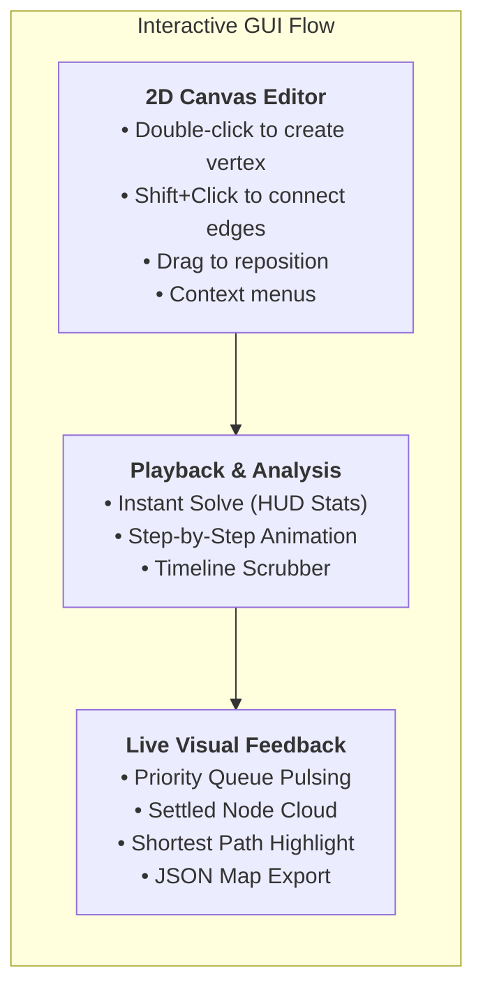
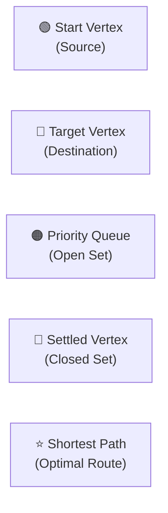

# Interactive Graphical UI (Dear ImGui + GLFW)

The **Dijkstra Interactive GUI** (`dijkstra-gui`) is a cross-platform desktop application built with **Dear ImGui** and **GLFW / OpenGL3** for visual graph editing and interactive algorithm exploration.



---

## 1. Launching the GUI

Build and launch the application:

```bash
# Build the project with GUI enabled
cmake -B build -DCMAKE_BUILD_TYPE=Release -DBUILD_GUI=ON
cmake --build build -j$(nproc)

# Run the interactive visualizer
./build/src/gui/dijkstra-gui
```

---

## 2. Canvas & Graph Editing Controls

| Action | Control | Description |
|:---|:---|:---|
| **Create Vertex** | `Double-Click` | Creates a new vertex at the cursor position $(x, y)$. |
| **Move Vertex** | `Click & Drag` | Repositions a vertex and updates all incident edge lengths in real time. |
| **Create Edge** | `Shift + Click / Drag` | Click a source vertex while holding `Shift` and connect to a destination vertex. Edge weight defaults to Euclidean distance. |
| **Select Start / Target** | `Click Vertex` | First click selects **Start (Source)**. Second click selects **Target (Destination)**. |
| **Vertex Context Menu** | `Right-Click Vertex` | Open options to set as Start/Target or delete vertex and incident edges. |
| **Edge Context Menu** | `Right-Click Edge` | Open options to edit numerical weight or delete edge. |
| **Pan Canvas** | `Right/Middle Drag` | Move camera view across the 2D infinite grid. |
| **Zoom In / Out** | `Mouse Wheel` | Scale canvas view between $0.2\times$ and $3.0\times$. |

---

## 3. Visualization Modes

### 3.1 Instant Mode (⚡ Fast)
- Computes optimal paths in sub-milliseconds ($< 10\text{ }\mu\text{s}$).
- Live **Execution Metrics HUD** displays:
  - Total Vertices and Edges.
  - Computation Time in microseconds ($\mu\text{s}$).
  - Settled Vertices count.
  - Total Shortest Path Distance.
  - Complete Reconstructed Route (`0 → 2 → 5 → 4`).

### 3.2 Step-by-Step Animation Mode (🎬 Interactive Playback)
- **Controls**: `[⏮ Reset]` `[⏪ Prev Step]` `[▶ Play / ⏸ Pause]` `[⏩ Next Step]`.
- **Speed Slider**: Configure step duration from $0.05\text{s}$ to $1.0\text{s}$.
- **Timeline Scrubber**: Scrub backwards or forwards to any discrete step of the algorithm.
- **Commentary Banner**: Real-time pedagogical explanation of the active edge relaxation step.

---

## 4. Didactical Color Legend



- 🟢 **Green**: Starting source vertex ($d=0$).
- 🔴 **Red**: Target destination vertex.
- 🟠 **Orange**: Candidate vertex currently in the Priority Queue (Open Set).
- 🔵 **Blue**: Settled vertex whose minimum distance is mathematically guaranteed (Closed Set).
- ⭐ **Gold**: Optimal shortest path connecting source to target.

---

## 5. Presets & Map Storage

- **Presets**:
  - **Wikipedia (6 Nodes)**: Canonical pedagogical graph.
  - **Ring Network**: Circular cycle graph.
  - **Star Network**: Central hub connected to radial leaf nodes.
  - **Grid Maze**: 2D grid graph with horizontal/vertical connections.
  - **Random Geometric**: Synthetic 2D geometric graph with configurable vertices and connection density.
- **JSON Storage**: Save and load custom map topologies with 2D spatial positions.
