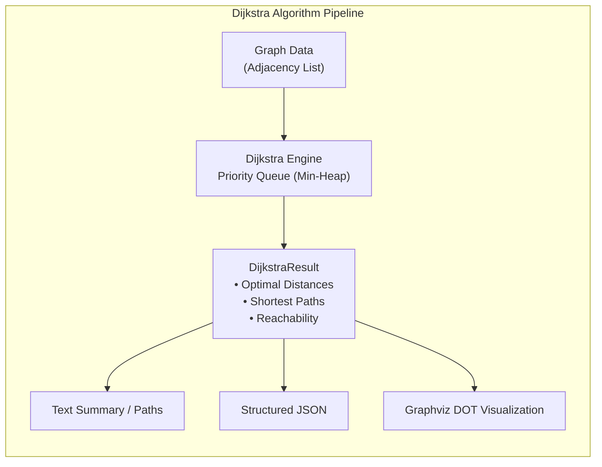

# Dijkstra — Modern C++ & Algorithm Guide

Welcome to the **Dijkstra** project documentation! This project is an educational and production-grade implementation of **Dijkstra's shortest path algorithm** and graph data structures in **modern C++ (C++20)**.



---

## Key Highlights

- **Pedagogical & Rigorous**: Comprehensive explanations of graph theory, priority queues, time complexities, and step-by-step traces.
- **Modern C++ (C++20)**: Built with C++20 features including `std::optional`, `<ranges>`, spaceship operator `<=>`, structured bindings, and robust exception handling.
- **Clean Decoupling**: Standalone static library (`dijkstra-lib`) with public API in `include/dijkstra/`, separated from command-line frontends.
- **High-Performance**: Memory-efficient adjacency lists ($O(V + E)$ space) and $O((V + E) \log V)$ time complexity using cache-friendly min-heaps.
- **Comprehensive Quality Assurance**: 100% test coverage across unit tests, CLI smoke tests, memory sanitizers (ASan/UBSan), and strict compiler warnings.

---

## Quick Start

### Build & Run Tests

```bash
# Configure debug build with tests
cmake -B build -DCMAKE_BUILD_TYPE=Debug

# Compile all targets
cmake --build build -j$(nproc)

# Run full test suite (unit + CLI integration)
ctest --test-dir build --output-on-failure
```

### Run Piped Pipeline

```bash
# Generate a random graph with 8 nodes and pipe into dijkstra search
./build/src/random-graph/random-graph -n 8 -k 3 -s 42 | ./build/src/dijkstra/dijkstra -s 0
```

Sample output:
```text
Running Dijkstra's algorithm... [0.005 ms.]
  → 0 [0]
0 → 1 [0.57554]
0 → 2 [0.671688]
1 → 3 [1.27469]
0 → 4 [0.574014]
```

---

## Documentation Roadmap

1. [**Algorithm & Theory**](algorithm.md): Mathematical foundation, invariants, relaxation, and step-by-step visual trace.
2. [**Data Structures**](data-structures.md): Adjacency matrix vs adjacency list, priority queue mechanics, and heap performance.
3. [**Modern C++ Features**](cpp-features.md): How C++20 features are applied in this codebase.
4. [**CLI Reference**](cli.md): Command-line options, JSON exports, and Graphviz visualization.
5. [**Testing & Quality**](testing.md): Unit tests, smoke tests, sanitizers (ASan/UBSan), and presets.
