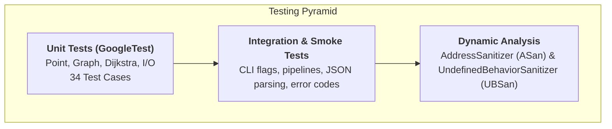

# Testing & Quality Assurance Strategy

A comprehensive testing strategy ensures algorithmic correctness, memory safety, and command-line stability.



---

## 1. Unit Tests (GoogleTest)

Unit tests are located in `test/unit/` and verify isolated components:

- **Point Tests (`point_test.cpp`)**: Euclidean distance edge cases, coordinate boundaries, deterministic random point distributions.
- **Graph Tests (`graph_test.cpp`)**: Insertion, deletion, neighbor queries, edge weights, directed/undirected graphs, matrix/DOT serialization, graph resizing, and domain exception throwing.
- **Dijkstra Tests (`dijkstra_test.cpp`)**: Canonical 6-node Wikipedia graph validation, disconnected graphs, single-node graphs, zero-weight edges, target-specific early exit, and reachability.
- **I/O Tests (`io_test.cpp`)**: Stream extraction/insertion roundtrips, malformed stream error recovery, and path summary formatting.

### Running Unit Tests
```bash
ctest --test-dir build --output-on-failure
```

---

## 2. Integration & Smoke Tests

The CLI integration suite (`test/integration/cli_test.sh`) runs the actual compiled binaries against edge cases:

1. Verification of `--help` and `-h` exit codes.
2. Rejection of invalid flags with non-zero exit codes.
3. Pipe communication between `random-graph` and `dijkstra`.
4. Target node path resolution.
5. JSON payload syntax validation using Python's `json` module.
6. DOT format graph structure validation.
7. File input vs `stdin` equivalence.
8. Proper error handling for nonexistent or corrupted files.

---

## 3. Dynamic Analysis: Sanitizers (ASan & UBSan)

To guarantee zero memory leaks, buffer overflows, and undefined behavior, the build supports LLVM/GCC sanitizers:

```bash
# Configure and build with AddressSanitizer and UndefinedBehaviorSanitizer
cmake -B build-asan -DCMAKE_BUILD_TYPE=Debug -DENABLE_SANITIZERS=ON
cmake --build build-asan -j$(nproc)

# Run test suite under sanitizers
ctest --test-dir build-asan --output-on-failure
```

---

## 4. CMake Presets

Standard workflows are codified in `CMakePresets.json`:

```bash
# Configure, build, and test using presets
cmake --preset default
cmake --build --preset default
ctest --preset default

# Sanitizer preset
cmake --preset asan
cmake --build --preset asan
ctest --preset asan
```
